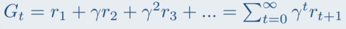

**Nom/Prénom Etudiant : Beaufreton Maxime, Kaczmarek Adrien**

# Rapport TP1
## 1 - Environnement déterministe ou stochastique

Avec la commande 'python gridworld.py -m', on obtient le modèle en **mode manuel sur la carte BookGrid** (par défault).
On peut remarquer plusieurs choses : 
- Les 2 seules récompenses par défaut sont les états terminaux (+1 et -1).
- La présence de noise (par défault à 0.2) fait que l'agent contrôlé manuellement 'glisse'.

## 2 - Agent aléatoire

Avec la commande 'python gridworld.py', on obtient un agent aléatoire dans l'environnement BookGrid.
Il n'y a pas encore de Value Iterations ou de q-values, l'agent se balade simplement de manière aléatoire dans l'environnement, jusqu'à rencontrer un état terminal.
\
Cependant, les valeurs courantes sont tout de même affichées, mais restent à 0.00.

## 3 - Algorithme Value Iteration

On souhaite maintenant implémenter un agent qui planifie hors-ligne sa politique avec
l’algorithme **value iteration.** \
L’algorithme **Value iteration** [Bellman,1957] calcule itérativement la fonction de valeur
optimale V* à partir du modèle MDP. On programmera et exécutera l'algorithme de la sorte :\

On peut ensuite extraire la politique **πk** à partir de **Vk** en calculant la politique gloutonne :\

Après avoir complété le code de ValueIterationAgents.py, on obtient avec la commande 'python gridworld.py -a value -i 100 -k 10' le résultat
suivant de l'algorithme de Value Iteration, pour 100 itérations : 

Ensuite, nous pouvons visualiser le comportement de l'agent pour 10 épisodes différents. 
L'agent suit bien (dans l'ensemble, pas toujours à cause du bruit (glissement)) les indications de la table de valeurs du Value Iteration algorithm, comme on pouvait s'y attendre.

## 4 - Influence des paramètres
Notre algorithme fonctionne correctement. On va donc désormais s’intéresser à l’influence des différents paramètres sur la politique optimale calculée. 
Pour cela, nous utiliserons deux autres labyrinthes

### 4.1 - BridgeGrid - Influence de Noise

On s'aperçoit que dans l’environnement BridgeGrid, avec les valeurs par
défaut de γ à 0.9 et du bruit à 0.2, la politique optimale ne permet pas à l’agent de
traverser le pont (i.e. d’atteindre la récompense maximale de 10).

En changeant le bruit pour noise = 0.01 (soit 1%), on obtient un résultat concluant. \
A noter que pour noise = 5%, la politique optimale ne permettait pas à l'agent de traverser le pont.

Deux éléments jouent dans l'hyper-sensibilité au bruitde l'algorithme de Value Iteration dans cet environnement :
- L'architecture elle même du 'labyrinthe', où un unique glissement est fatal pour l'agent
- Le fait que les récompenses-malus soient grandement supérieures (en valeur absolue) au bonus 

Le premier point est évident. Développons le second :
Soit x le noise. Pour atteindre la récompense bonus, l'agent doit effectuer consécutivement 'Droite' 6 fois. 
Sur les 6 mouvements, 5 sont susceptibles de le faire chuter dans un état terminal 'malus' avec une probabilité x.
La probabilité d'atteindre l'état terminal bonus est donc de (1-x)5, pour obtenir une récompense 10,
tandis que la probabilité de ne pas l'atteindre (en effectuant les bonnes actions) est de 1-(1-x)5 pour une récompense de -100. \
On veut donc : **(1-x)5 >= 10(1-(1-x)5)**  (facteur 10 du fait des récompenses de valeur différentes) \
Soit  **11(1-x)5 >= 10**, \
(1-x) = 0.981, soit **un bruit au maximum égal à 1.88 %**

On peut vérifier la cohérence de ce résultat en regardant la table-résultat du Value Iteration Algorithm pour un noise = 0.02 (soit 2%). \
(Commande : python gridworld.py -a value --grid=BridgeGrid -i 100 -k 5 -n 0.02) \
On perçoit que l'algorithme est à la limite et proche de trouver le chemin.

### 4.2 - DiscountGrid

Dans l’environnement DiscountGrid on distingue deux types de chemins : 
- Des chemins courts mais risqués qui passent près de la ligne du bas (qui a des état terminaux avec récompense-malus)
- Des chemins plus longs mais plus sûrs qui passent par le haut du labyrinthe.

On a pour valeurs initiales du modèle γ = 0.9, noise=0.2, rother = 0.0,

En partant de ces valeurs initiales, en changeant un seul des trois paramètres, nous allons obtenir successivement les politiques optimales suivantes :
1. qui suit un chemin risqué pour atteindre l’état absorbant de récompense +1 ;
2. qui suit un chemin risqué pour atteindre l’état absorbant de récompense +10 ;
3. qui suit un chemin sûr pour atteindre l’état absorbant de récompense +1 ;
4. qui évite les états absorbants.

On décide de modifier **rother** pour obtenir les différentes politiques optimales

#### 1 - Chemin risqué - Etat absorbant de récompense +1

Réponse : **rother = -3**. \
Justifications/Cheminement : \
L'idée est de rendre l'agent averse aux longs chemins, et donc de lui donner un malus pour chaque étape supplémentaire.
On rappelle la définition de G, la récompense accumulée :

Le malus doit vérifier plusieurs règles : \
- **rother < 0** \
On a Gsouhaité = rother(1 + γ + γ2) + γ3 \
Il faut donc que :
- [1] Gsouhaité > G'suicide' = rother -10γ (Récompense obtenue pour le fait d'aller directement dans l'état absorbant négatif le plus proche)
- [2] Gsouhaité > Grécompense10 = rother(1 + γ + γ2+ γ3+ γ4) + 10γ5 (Récompense obtenue pour aller à l'état absorbant de récompense +10)
 
[2] :  γ3 > rother(γ3 + γ4) + 10γ5 \
γ !=0 donc [2] : 1 -10γ2 > rother(1 + γ) \
[2] : **-3.74 > rother**

[1] : rother(γ + γ2) + γ3 > -10γ \
[1] : **rother > -9.729/(1.71) = -5.7**

Ces résultats sont corrects dans un cas déterministe avec un bruit n = 0.0. Dans ce cadre, on a finalement : \
**-5.7 < rother < -3.74**

Exemple avec **rother = -5** ci-dessous : \
(commande : python gridworld.py -a value --grid=DiscountGrid -i 100 -k 5 -r -5 -n 0.0)\

Avec un bruit n non nul (n = 0.2 par défaut), on s'aperçoit que **rother = -5** ne convient plus, et que **rother = -3** est plus adapté. (Voir ci-dessous) \
(commande : python gridworld.py -a value --grid=DiscountGrid -i 100 -k 5 -r -3) \
Pour le résultat demandé (modification d'un seul paramètre), on choisira donc **rother = -3**\

#### 2 - Chemin risqué - Etat absorbant de récompense +10

Réponse : **rother = -1**. \
Justifications/Cheminement : \
Le raisonnement est similaire à celui de la partie précédente :
L'idée est de rendre l'agent averse aux longs chemins, et donc de lui donner un malus pour chaque étape supplémentaire.
Cependant, on veut que l'agent atteigne l'état absorbant de récompense +10 cette fois.
On a donc [2] qui change : \

- [3] Gsouhaité = Grécompense10 = rother(1 + γ + γ2+ γ3+ γ4) + 10γ5 > rother(1 + γ + γ2) + γ3 = Grécompense+1 
En addition nous avons :
- [4] Grécompense10 < Grécompense+1-cheminlong
 
Dans un cadre déterministe, avec γ = 0.9 on obtient : \
**rother < -3.74** \
On peut essayer avec les commandes suivantes que la limite à -3.74 est réelle pour un bruit nul : \
python gridworld.py -a value --grid=DiscountGrid -i 100 -k 5 -r -3.73 -n 0.0 \
python gridworld.py -a value --grid=DiscountGrid -i 100 -k 5 -r -3.75 -n 0.0

Avec le bruit n=0.2 par défaut, ce résultat ne fonctionne plus. On choisit donc **rother = -1**, qui répond à la question.

#### 3 - Chemin sûr - Etat absorbant de récompense +1

Réponse : **γ = 0.3** \
Justifications/Cheminement : \
Par un rapide calcul des récompenses accumulées, on s'aperçoit rapidement qu'essayer de modifier rother ne fonctionnera pas.\
En effet, on obtient toujours une impossibilité sur le paramètre (dans un cadre déterministe) dans les équations : \
 Gsouhaité = G+1-Long ici, et on veut:
- [5] G+1-Long > G10-Long
- [6] G+1-Long > G10-Court, \
sans détailler les calculs, on arrive à 2 inégalités incohérentes donc un ensemble des solutions vide pour rother. 
Par ailleurs, de rapides tests semblent montrer l'impossibilité de répondre à cette question en modifiant rother même avec un bruit n=0.2.

On choisit donc de modifier γ, qui semble une piste plus prometteuse :\
On a : rother=0 et on suppose γ !=0
 - [5] <=> 1 > 10γ²
 - [6] <=> γ²> 10
10 < γ² < 1/10, soit : \
3.16 < γ < 0.3162

On s'aperçoit que dans un cadre déterministe, cette solution ne fonctionne pas.
Cependant, le bruit peut ici nous aider, en 'dissuadant' l'agent de prendre un chemin risqué 
(beaucoup de bruit = chute dans un état absorbant malus probable.) 

Donc, le chemin court étant défavorisé (bruit et rother nul), on essaye de trouver une solution γ
en se préocuppant uniquement de [5], i.e **γ < 0.3162**.

Commande : python gridworld.py -a value --grid=DiscountGrid -i 100 -k 3 -d 0.3 \
Résultat :\

#### 4 - Qui évite les états absorbants

Réponse : **rother = 2**. \
Justifications/Cheminement : \
On cherche le raisonnement opposé à la situation 1 :
L'agent doit tellement aimer les longs chemins qu'il reste en vie en évitant tous les états absorbants.
On lui donne donc un bonus pour chaque étape supplémentaire. \
Une solution évidente et simple est rother = 10.1. Dans ce cas, même à côté de la récompense maximale, 
l'agent préfèrera éviter l'état absorbant.\
Dans les faits, des récompenses rother plus faibles fonctionnent parfaitement :\
Avec rother = 2 : \
python gridworld.py -a value --grid=DiscountGrid -i 100 -k 3 -r 2

On observe bien sur la figure ci-dessous que dans tous les cas de figure, l'agent évite l'état absorbant.

# Rapport TP2 - Apprentissage par renforcement
## 1 Agent Q-Learning tabulaire
## 1.1 Agent avec exploration manuelle
### Question 1 :
Voir code. On a bien utilisé la méthode setQvaleur pour toute modification d’une Q-valeur.

### Question 2 :
En mode manuel, avec la commande python gridworld.py -m -a q --grid=DiscountGrid -k 5, on obtient en se baladant un peu:\

Et on peut suivre dans le terminal également la bonne actualisation des QValues

## 1.2 Agent avec stratégie d’exploration
### Question 3 :
On implémente la stratégie epsilon-greedy dans la méthode getAction de la classe QLearningAgent. (cf. code)

### Question 4 :
Pour 100 itérations avec epsilon = 0.2, on obtient la carte des q-values suivante :\

Pour 100 itérations de l'algorithme de qvalue on a également :\

## 1.3 Nouvel environnement : le robot "crawler"
### Question 5 :
La récompense du crawler est reward = newX - oldX. La récompense maximale semble ici
être de 8.57, pour la politique suivante :
C'est dans l'état juste avant celui de la photo ci-dessous, quand le robot tire que la reward est la plus importante.
Cela s'explique par un tiré assez long, donc un grand déplacement. \
L'algorithme va donc chercher à maximiser les récompenses obtenues lors des phases de tiré.
Deux comportements dont il faut faire un compromis peuvent émerger :
- Alternance tirer/pousser rapide, déplacement vers l'avant faible mais nombreux 
- Phase de soulevé du crawler plus longue mais déplacement long

### Question 6 :
Le comportement émergent semble plutôt être une politique des 'petits pas', on ne voit pas l'agent
apprendre à déployer son bras longuement pour effectuer un grand pas. Cela semble cohérent car
ce comportement permet à l'agent d'avoir des récompenses positives plus souvent que le comportement 'long'.\

## 2 Maintenant Jouons à Pacman !
### 2.1 Jeu Pacman
La commande python pacman.py -l mediumClassic fonctionne. 
La conclusion est sans équivoque : Je suis meilleur qu'Adrien à Pacman.

### 2.2 Q-Learning tabulaire pour le jeu Pacman : comment définir les états du MDP ?
Déjà fait en Python.

### 2.3 Q-Learning et généralisation pour le jeu Pacman
On teste notre algorithme pour voir si Pacman apprend correctement : \
Commande :\
python pacman.py -p PacmanQAgent -x 2000 -n 2010 -l smallGrid \

Il s'avère que Pacman, après entraînement, évite sans problème le fantôme et
réussi à manger toutes les pac-dots sans mourir.\

On teste à nouveau l'algorithme : \
Commande :\
python pacman.py -p PacmanQAgent -x 2000 -n 2010 -l smallGrid2\

Il s'avère que Pacman, après entraînement, réussi moins bien que dans smallGrid.
Dans SmallGrid2, Pacman semble perdu, évoluant de manière aléatoire et ne fuyant pas le fantôme.\

Avec 2 fois plus d'entraînements, on arrive toujours pas à rendre Pacman performant, bien qu'il
évite mieux le fantôme dans l'ensemble :\

Même après différents tests en modifiant alpha, epsilon et gamma, le résultat reste peu convaincant.
Nous allons donc implémenter une méthode d'extraction de features pour améliorer de manière significative la performance du système.

### On complète désormais la classe ApproximateQAgent(PacmanQAgent)
Dans cette partie, l’objectif est d’améliorer les capacités de généralisation entre états
du Q-Learning, en utilisant une fonction d’approximation pour approximer la fonction
Q. Pour l'implémentation voir qlearningAgents.py. La fonction Q est approximée comme une combinaison linéaire de M features ou fonctions caractéristiques Φi.
:\

L'extracteur par défaut est l'extracteur identité. Cela revient à définir : **∀i, ∀(s,a) Φi(s,a) = 1**\
Après quelques tests, cette extraction, qui permet seulement un ajustement des poids θi, est jugée insufisante.
Les résultats sont en effet tout aussi médiocres que sans extracteurs, pour le même nombre d'entrainements.

On utilise donc donc un extracteur plus raffiné : 'SimpleExtractor'.\
Cet extracteur possède en features :
- Un terme de biais
- Un terme qui témoigne de la proximité des fantômes (enjeu 'survie')
- Un terme qui témoigne de la volonté de manger (enjeu 'score')
- Un terme qui témoigne de la proximité de la nourriture (enjeu 'trouver score')

Cet extracteur, bien que simple est astucieux. En effet, nous attendons de Pacman qu'il :
- Fuit si des fantômes sont proches (feature 'survie')
- Cumule des points en mangeant des pac-dots si et seulement si la survie n'est pas primordiale à cet instant
- Trouve de quoi cumuler des points : Trouver des pac-dots 
Un terme de biais est présent (comme dans beaucoup de modèle).

L'algorithme (ci-dessous), implémente cette vision de manière juste : \
La feature "# ghost-1-step" correspond à l'enjeu survie. \
La feature "eats-food" correspond à l'enjeu de cumulation de point, et n'est implémentée que si l'enjeu survie n'est pas actif. 
On priorise donc là la survie de manière équivoque.\
La feature "closest-food" correspond à l'enjeu 'détection de pac-dots'.

    features['bias'] = 1.0

    # compute the location of PacMan after the action :
    x, y = state.getPacmanPosition()
    dx, dy = Actions.directionToVector(action)
    next_x, next_y = int(x+dx), int(y+dy)

    # We count the number of ghost 1-step away
    features["# ghost-1-step"] = sum((next_x, next_y) in Actions.getLegalNeighbors(g, walls) for g in ghosts)

    # If it is safe (no ghosts) => Add the food feature
    if not features["# ghost-1-step"] and food[next_x][next_y]:
      features["eats-food"] = 1.0
    dist = closestFood((next_x, next_y), food, walls)
    if dist is not None:
      features["closest-food"] = float(dist)/ (walls.width * walls.height)
    features.divideAll(10.0)

On s'aperçoit qu'avec cette extraction de features, Pacman est bien plus performant : Sur SmallGrid2
pour seulement 50 épisodes d'entrainements (contre 2000 avec le modèle sans extracteurs aux performances médiocres),
le résultat est très satisfaisant : Une fois entraîné, Pacman gagne systématiquement.
Commande : \ 
python pacman.py -p ApproximateQAgent -a extractor=SimpleExtractor -x 50 -n 60 -l smallGrid2 \

Et même sur MediumClassic - 50 épisodes d'entrainements : Une fois entraîné, Pacman gagne presque systématiquement.
Commande : \ 
python pacman.py -p ApproximateQAgent -a extractor=SimpleExtractor -x 50 -n 60 \

On est conclut que cette extraction de features est pertinente pour notre problème, et que nous
avons réussi à créer un algorithme permettant à Pacman de gagner face aux fantômes.